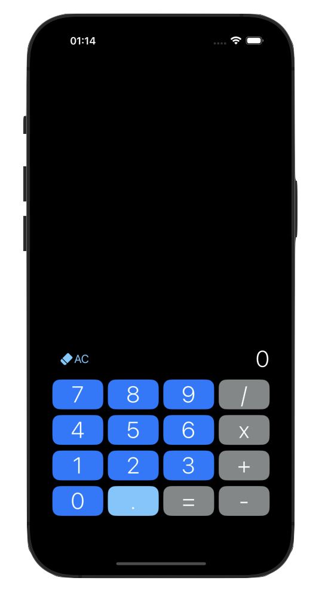
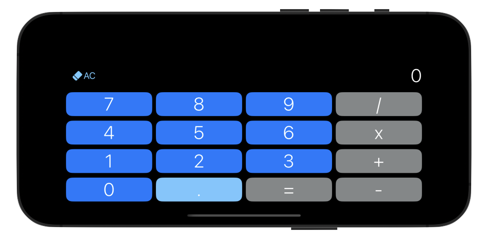

# Calculator
A calculator app built using **Swift** that allows users to perform basic mathematical operations.
It features a clean, simple and intuitive UI.

## Screenshots

  
  

### Compatibility

This app is compatible with the following devices: iPhone 16 Pro Max, iPhone 16 Plus, iPhone 11 Pro Max, iPhone 16, iPhone 16 Pro, iPhone 11, iPhone 14, iPhone 13 Mini, iPhone 8 Plus, iPhone SE (3rd and 1st generation)

## Author
### Paulina Zabielska 
Github: [https://github.com/zpaulinz]
